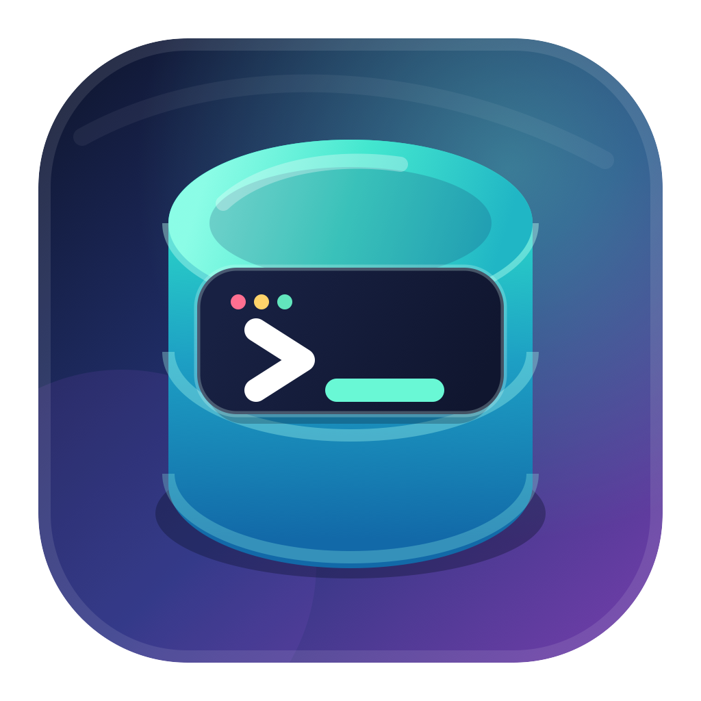

# Selektos



A native macOS SQL client built with SwiftUI, AppKit, Security, and Swift concurrency. PostgreSQL transport is provided by PostgresNIO, while Cloudflare D1 access uses the authenticated Wrangler CLI.

Published by **Pluto Labs**.

## Open and run

Open `Package.swift` in Xcode, select the `Selektos` scheme, and run the app.

From Terminal:

```sh
swift run Selektos
```

## Current features

- User-defined workspaces persisted in Application Support
- Multiple PostgreSQL connections per workspace
- Password storage in macOS Keychain
- TLS disable, prefer, and require modes
- Live schema and table discovery
- Persistent query tabs with a native AppKit editor
- Per-tab database and schema focus from the editor toolbar
- Native Settings window for general behavior, appearance, workspaces, and connections
- Query execution and cancellation
- Dynamic result grids for arbitrary result shapes
- PostgreSQL error and execution status display
- Cloudflare D1 remote database discovery and query execution through Wrangler

Query result display is capped at 10,000 rows to keep the desktop UI responsive. Add a `LIMIT` clause when exploring large tables.

## Schema focus

Connecting as a superuser exposes every schema at once. The editor toolbar has **Database** and **Schema** dropdowns to narrow that down.

The schema choice is stored per query tab, so different tabs can target different schemas on the same connection. Selecting one sets the connection's `search_path` to that schema followed by `public`, meaning:

- unqualified names such as `SELECT * FROM orders` resolve in the focused schema first
- `public` stays reachable, so shared tables keep working
- fully qualified names such as `other_schema.orders` are unaffected

Choose **All schemas** to leave the server's default `search_path` untouched. Double-clicking a table replaces the current query with a schema-qualified `SELECT *` limited to 100 rows and runs it immediately; no new tab is created. Postgres-internal schemas (`pg_*`, `information_schema`) are hidden from the dropdown; query them by qualifying the name.

Switching database clears the schema focus for that connection's tabs, since schema names are database-scoped.

## Settings

Open **Selektos → Settings** or press `Command-,`.

- **General:** launch behavior, automatic metadata loading, result row limit, default query text, and state-file location
- **Appearance:** system/light/dark theme, live editor font size, line numbers, and inspector visibility
- **Workspaces:** create, activate, rename, and delete workspaces
- **Connections:** choose a workspace, then add, edit, or delete PostgreSQL and Cloudflare D1 connections

Preferences use macOS `UserDefaults`. Workspace/query state remains in `~/Library/Application Support/Selektos/workspaces.json`; PostgreSQL passwords remain in macOS Keychain.

## Cloudflare D1

Authenticate Wrangler before adding a D1 connection:

```sh
wrangler login
```

In the connection sheet, choose **Cloudflare D1**, leave the Wrangler executable as `wrangler`, and click **Discover**. Selektos automatically detects common global installations, including Homebrew, npm, and NVM. For a project-local install, provide the full path to its executable, typically `node_modules/.bin/wrangler`.

The app executes D1 queries remotely with `wrangler d1 execute --remote --json`. Cloudflare tokens are managed entirely by Wrangler and are not read or stored by Selektos.

## MCP server

Selektos includes a local stdio [Model Context Protocol](https://modelcontextprotocol.io/) server so AI agents can query saved PostgreSQL and Cloudflare D1 connections.

Open **Selektos → Settings → MCP Server** to:

- enable or disable MCP access
- keep agent access read-only, which is enabled by default
- cap the number of rows returned by each tool call
- copy an MCP client configuration using the current Selektos executable
- review the connection-specific database tools exposed to agents

The server exposes `list_connections` plus four tools for every saved connection:

| Tool | Purpose |
|------|---------|
| `list_tables_<connection>_<id>` | List accessible tables and views without reading their rows |
| `describe_table_<connection>_<id>` | Return column, type, nullability, default, and primary-key metadata |
| `preview_table_<connection>_<id>` | Safely quote a table name and return a limited row preview |
| `query_<connection>_<id>` | Execute a specific SQL statement with an optional row limit |

`list_connections` returns connection metadata and all corresponding tool names. PostgreSQL tools accept optional `database` and `schema` arguments where applicable. Passwords remain in macOS Keychain and are never exposed through MCP.

Read-only mode uses multiple safeguards:

- SQL is conservatively validated before execution and mutating statements are rejected
- PostgreSQL queries run inside a read-only transaction with `default_transaction_read_only` enabled
- table discovery, description, and preview tools always use read-only execution, even when arbitrary SQL is configured for read/write access

Turn off **Read-only access** only when agents should be allowed to execute arbitrary SQL using your saved credentials. Restart the MCP client after changing access settings, row limits, or connections so it refreshes its server process and tool list.

## Distribution

The repository includes a direct-distribution pipeline for macOS. It creates a signed `Selektos.app` bundle with Pluto Labs metadata, the app icon, and privacy manifests, then packages it as DMG and ZIP archives.

Create a native-architecture development build:

```sh
make dist
```

Create a universal Apple silicon and Intel build:

```sh
make dist-universal
```

Artifacts are written to `dist/`. Builds are ad-hoc signed by default so they can be tested locally. For a public release, sign with the Pluto Labs Developer ID certificate:

```sh
SIGNING_IDENTITY="Developer ID Application: Pluto Labs (TEAM_ID)" \
VERSION=1.0.0 \
BUILD_NUMBER=1 \
make dist-universal
```

Store App Store Connect notarization credentials once:

```sh
xcrun notarytool store-credentials pluto-labs \
  --apple-id "APPLE_ID" \
  --team-id "TEAM_ID" \
  --password "APP_SPECIFIC_PASSWORD"
```

Then notarize and staple the DMG:

```sh
NOTARY_PROFILE=pluto-labs make notarize
```

Regenerate the PNG and ICNS files from the editable SVG source with:

```sh
make icon
```

The default release version lives in `VERSION`. `BUILD_NUMBER` should increase for each published build.
